# 🩺 Diabetes Prediction Project

This project demonstrates how to build a **machine learning pipeline** for predicting diabetes based on patient health indicators, and then deploy it as a **Streamlit web app**.

⚠️ **Disclaimer**: This project is for **educational purposes only**. It is **not a medical tool** and should not be used for real-world diagnosis or treatment.


### 🚀 Try the App [Try it on Streamlit Cloud](https://healthcarediabetesprediction-ch9kcdd9iouyetqjs9d3gv.streamlit.app/)

---

## 📂 Project Structure

```
├── healthcare_diabetes.csv         # Dataset
├── notebook.ipynb                  # Jupyter Notebook (Data analysis + ML pipeline)
├── app.py                          # Streamlit application
├── models_cache/                   # Trained ML models saved as pickle
├── encoders_scalers/               # Encoders and scalers saved as pickle
├── models_predictions/             # Model prediction outputs (CSV)
├── eval_dataset.csv                # Evaluation results
```

---

## 🚀 Steps Taken

### 1️⃣ Importing Libraries

We used popular libraries like **pandas, numpy, seaborn, matplotlib, sklearn**, and **pickle** to build the pipeline.

---

### 2️⃣ Data Loading & Exploration

* Loaded the dataset: `healthcare_diabetes.csv`
* Previewed first, random, and last samples
* Checked dataset statistics and data types

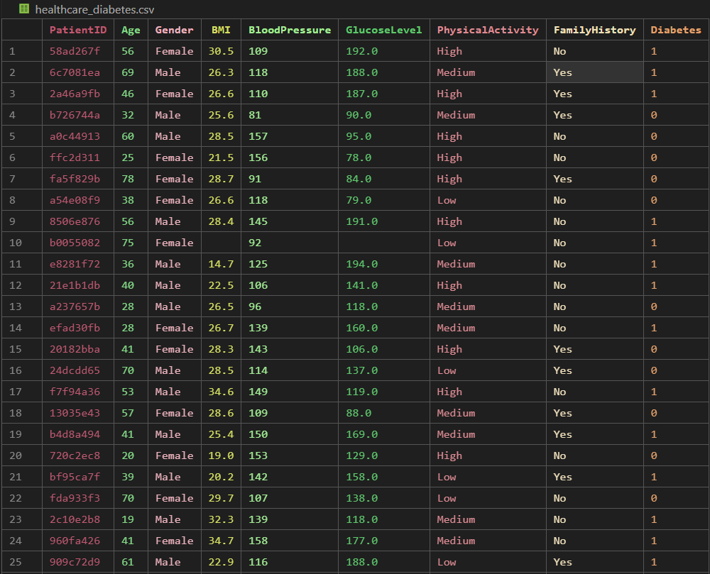

---

### 3️⃣ Data Cleaning

* Converted categorical features to `string`
* Converted numerical features to `float`
* Converted target column `Diabetes` to `int`
* Removed duplicates
* Removed rows with all null values

---

### 4️⃣ Missing Value Handling

We created a **custom imputation function** (`replace_null`) that fills missing values using the **median**, based on categories like Gender, Physical Activity, and Family History.

---

### 5️⃣ Feature Engineering

* Dropped irrelevant features (`PatientID`)
* Added multiple **derived features**:

  * Polynomial: $X^2, X^3$
  * Logarithmic: $\log_e(X), \log_{10}(X)$
  * Square root: $\sqrt{X}$
  * Exponential: $e^X$
  * Reciprocal: $\frac{100}{X}, \frac{100}{X^2}$
* Removed **highly correlated features** (> 0.9 correlation)

---

### 6️⃣ Exploratory Data Analysis (EDA)

#### Count Plots

* Distribution of categorical features
* Distribution of target variable

#### Histogram & KDE Plots

* Distribution of numerical features overall and grouped by target

#### Box Plots

* Relationship of numerical features with target variable

#### Correlation Heatmap

* Checked correlations among all features

#### Business Questions Answered:

* Does age affect diabetes risk?
* Does high glucose level increase diabetes risk?
* How does BMI vary between diabetic and non-diabetic patients?
* Does physical activity affect diabetes risk?

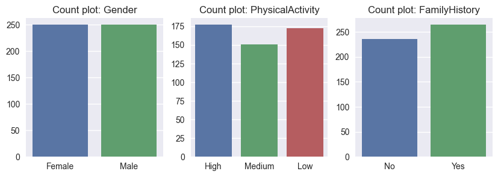
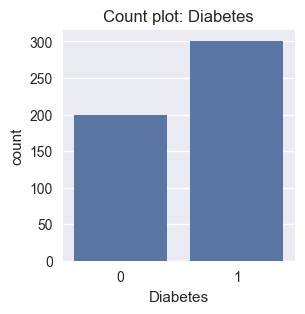
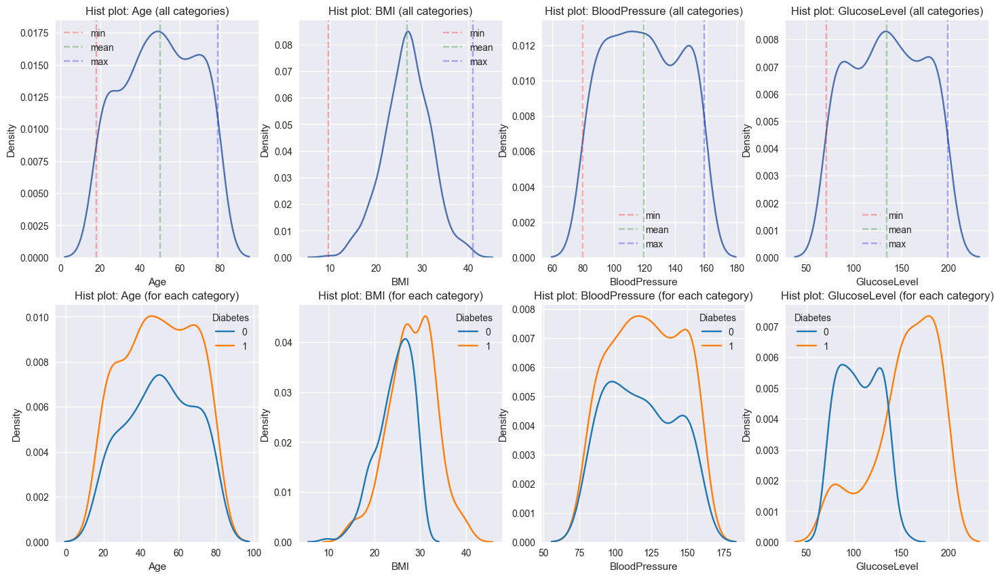
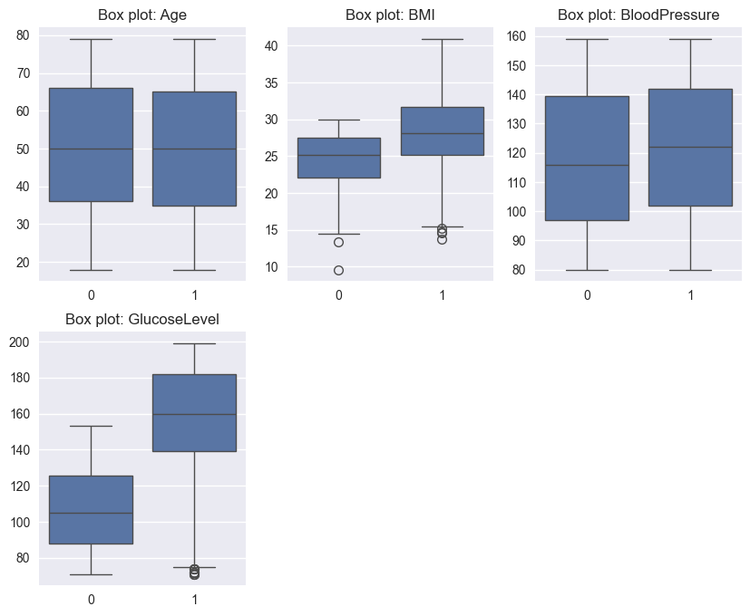
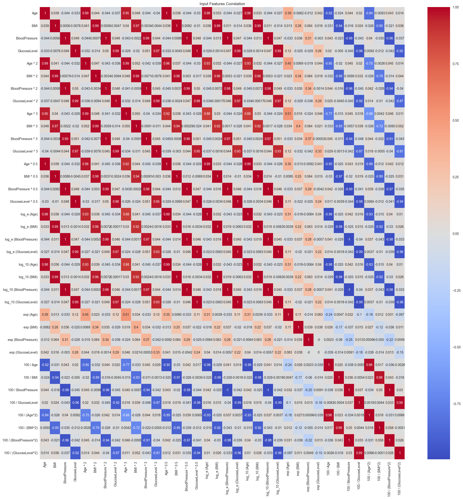

---

### 7️⃣ Outlier Handling (optional)

* Considered using **IQR method** (commented in notebook).

---

### 8️⃣ Encoding & Scaling

* **Ordinal Encoding**: Physical Activity (Low → 1, Medium → 2, High → 3)
* **One-Hot Encoding**: Gender, Family History
* **Min-Max Scaling**: Numerical features

---

### 9️⃣ Train-Test Split

* Stratified split into **75% training** and **25% testing**

---

### 🔟 Class Balancing

* Computed **class weights** using `compute_class_weight`

---

### 1️⃣1️⃣ Model Training

Implemented a **custom model wrapper class** (`CustomModel`) with:

* Save/load caching
* Train/predict methods

Trained models:

* Logistic Regression
* SVM (linear, poly, rbf, sigmoid)
* Decision Tree (depth 4–7)
* Random Forest (3–5 trees)
* (Optional) AdaBoost, Gradient Boosting (commented)

---

### 1️⃣2️⃣ Model Evaluation

Metrics computed for train & test sets:

* Accuracy
* Precision
* Recall
* F1 Score
* ROC-AUC

Visualized metrics with bar plots:
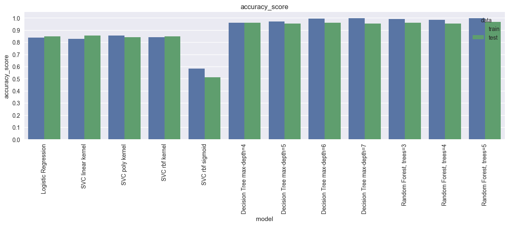

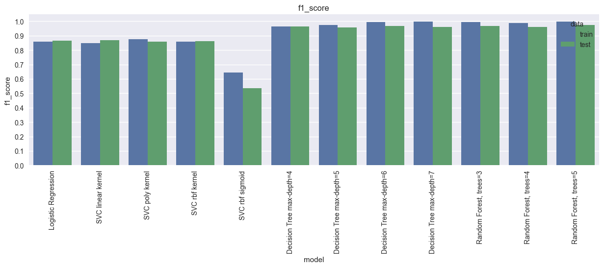
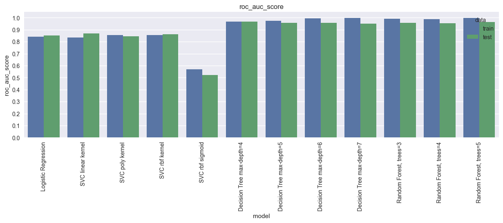
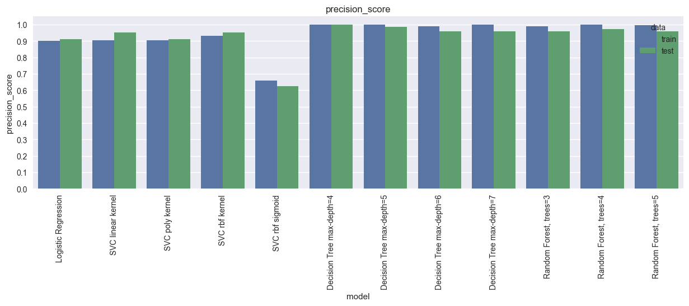

---

### 1️⃣3️⃣ Model Visualization

* Decision Tree visualizations
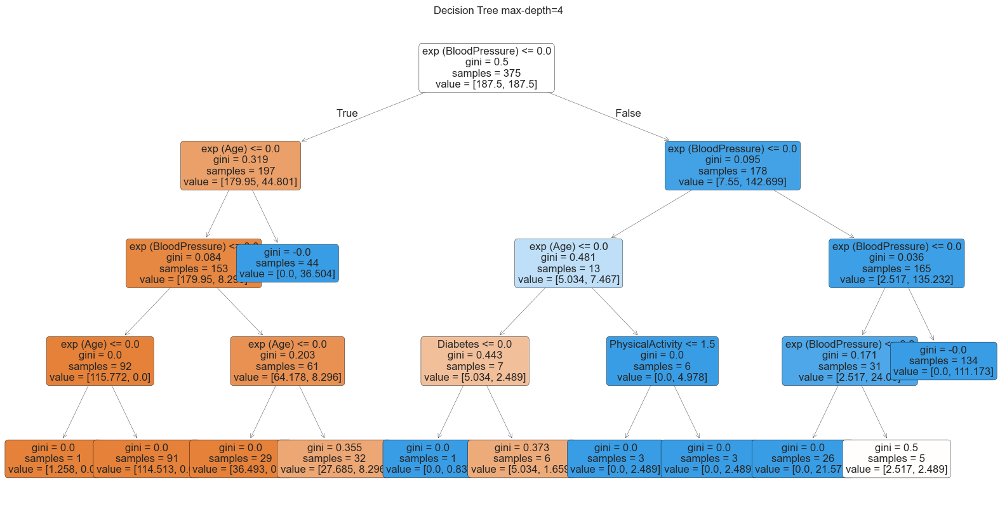
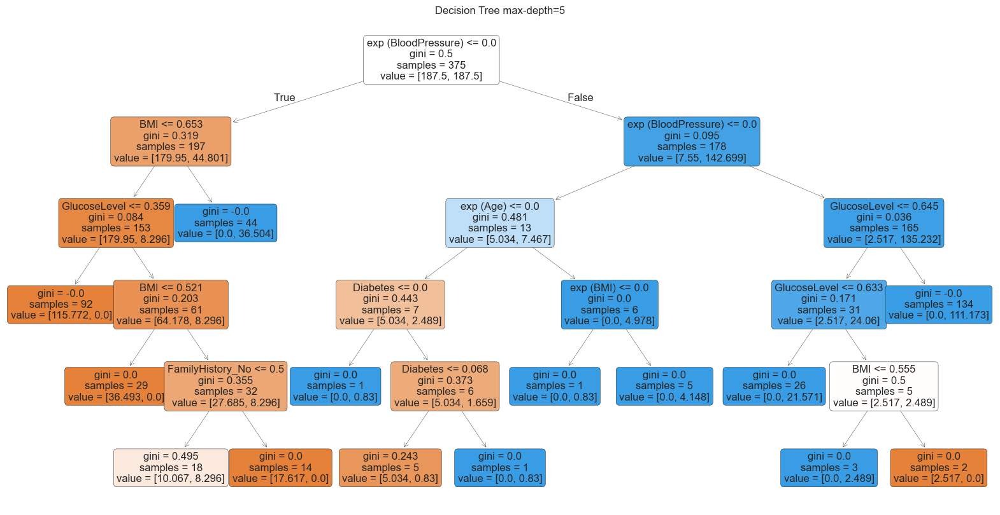
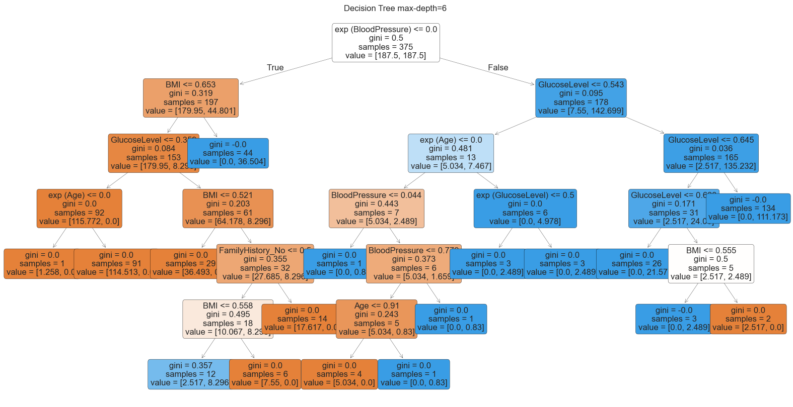
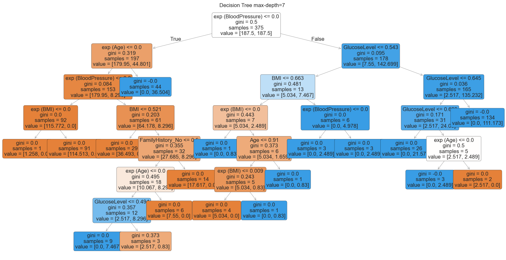
* Random Forest individual estimators
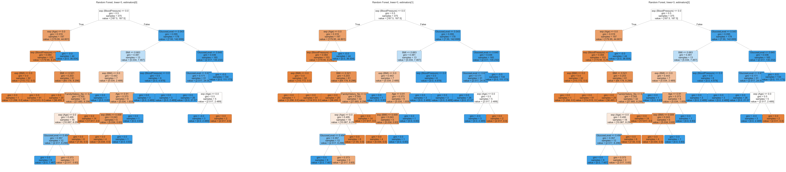
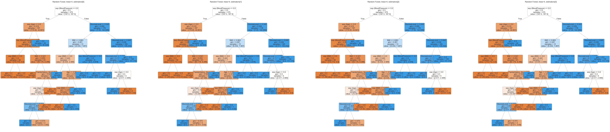
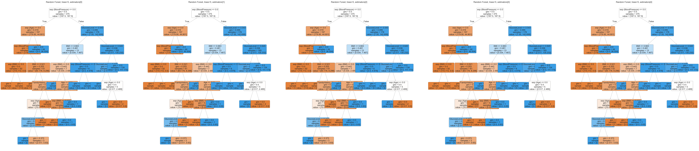
* AdaBoost estimators

---

### 1️⃣4️⃣ Model Saving

* Saved models in **`models_cache/`** as `.pickle`
* Saved encoders/scalers in **`encoders_scalers/`**
* Saved evaluation dataset as `eval_dataset.csv`
* Saved model predictions in **`models_predictions/`**

---

## 🌐 Streamlit App

We built an **interactive web app** using **Streamlit**:

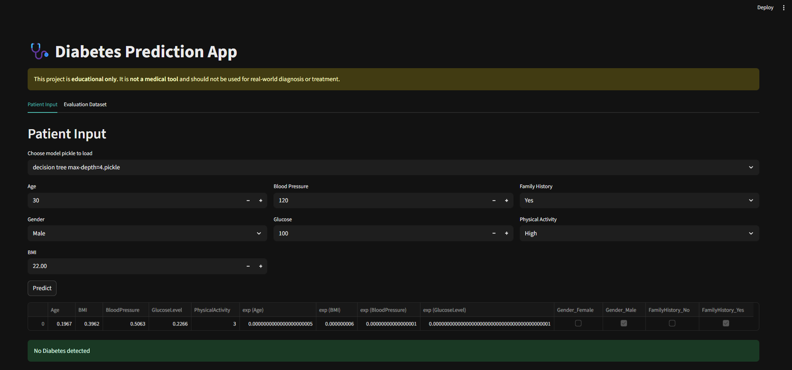

### Features:

* Select trained model from dropdown
* Input patient details:

  * Age
  * Gender
  * BMI
  * Blood Pressure
  * Glucose
  * Family History
  * Physical Activity
* Predict Diabetes (Yes/No)
* View Evaluation Dataset

### Run the app:

```bash
streamlit run app.py
```
